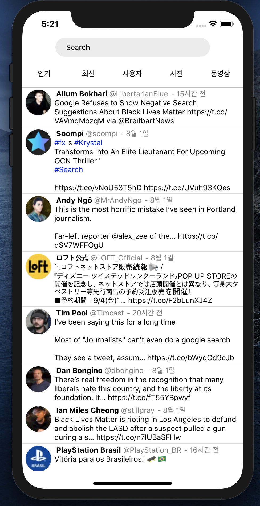
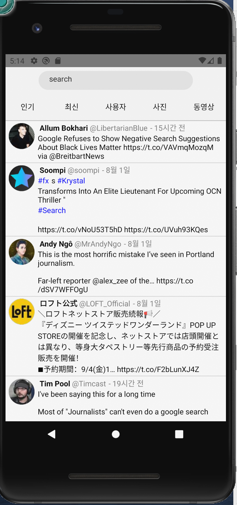

# 위 허들링 코딩테스트


1. 테스트 작성 기간: 9시간
2. 프로그램 완성도: 40% ( 인기 검색만 되며, 해시테그 만 캐치를 하였다.)
3. 결과 캡처 화면




4. 소스 코드 내부 구조 및 Flow

   ```
   - App
   	- search
   	- twits
   	
   	-App		//검색을 하여 결과값을 twits/ 에 넘긴다.
   	
   -search
   	- searchBar //서치검색 바
   	- searchTab	//검색 Type 탭
   	
   - twits				// 검색 결과를 노출되는 부분
   	- Twit			// Twit 
       - TwitDate	// Twit 의 created_at 의 폼을 변환
       - TwitText	// Twit 의 text의 hash값을 찾아 변환
   ```

5. 좋았던점/ 어려웠던 점/ 아쉬운 점

   - 좋았던점 
     - RN 을 Expo 를 사용하지 않고 사용해보았다.
     - 트위터 API 를 사용해 데이터가 어떻게 나오는지 확인할수있었다.
     - shouldUpdate 를 사용해 pureComponents 를 흉내내보았다.
   - 어려웠던 점
     - 트위터 API 의 결과값에 대해 자세한 설명이 없어 분석하는데 어려웠다.
     - 결과값을 재대로 분석할수 없었다.
     - 해시태그, url 가 text 에 포함되어 있고, indices 를 이용해 대체를 해야했다.
     - #을 입력했을경우 검색이 되지않았다.
   - 아쉬운 점
     - 시간을 더 사용할수 있었으면 인기, 최신, 사용자 등 searchTap 를 구현할수 있었다.
     - 무한스크롤을 구현하지 못한것이 아쉽다.